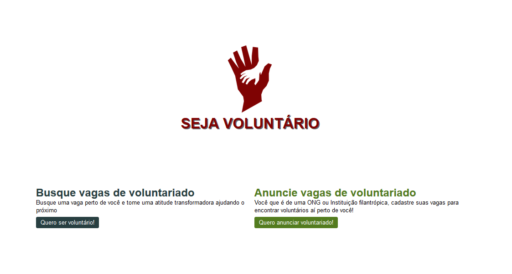
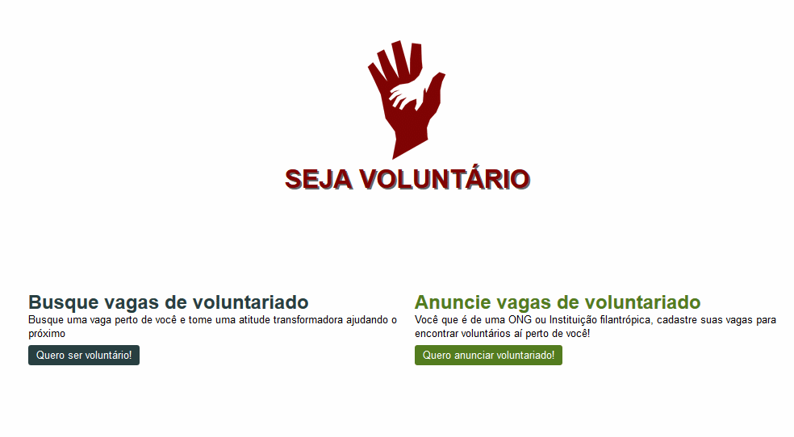
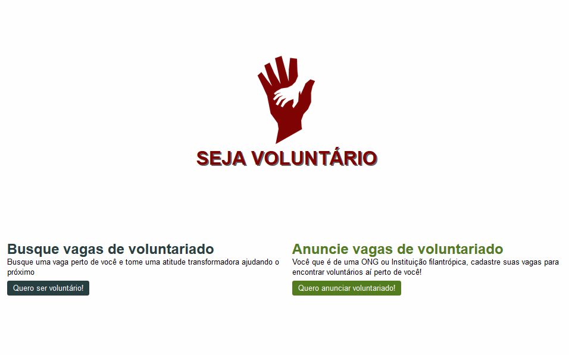

<div align="center">
    <h1>Seja Voluntário</h1>
    
</div>

## :beginner: Exemplos

<b style="font-size:22px;">Demonstrando a home da aplicação:</b>

<h3 align="center">
  
</h3>

<b style="font-size:22px;">Demonstrando a lista de vagas de voluntariado:</b>

<h3 align="center">
  
</h3>

<b style="font-size:22px;">Demonstrando a página de busca para vagas de voluntariado:</b>

<h3 align="center">
  
</h3>

<b style="font-size:22px;">Demonstrando a página de cadastro para vagas de voluntariado:</b>

<h3 align="center">
  
</h3>

<b style="font-size:22px;">Demonstrando a busca de vagas para voluntario</b>

<h3 align="center">
  
</h3>

<b style="font-size:22px;">Demonstrando a criação de vagas para voluntariado</b>

<h3 align="center">
  
</h3>

---

## :notebook: Sobre o projeto:

Um projeto desenvolvido durante a semana FullStack essencial da Cod Dev! Trata-se de uma aplicação voltada para o meio social, ONG's e agentes da caridade. Com um fácil cadastro para as ONG's/Empresas que precisam de ajuda para socorrer os mais necessitados.

---

## :book: O que aprendi ?

1. HandleBars.
2. Implementar o SQLite
3. Vue
4. Flex Layout.
5. :muscle: e várias outras coisas!

---

## :hammer: Tecnologias utilizadas:

- JS
- HTML
- CSS
- VUE

---

## :rocket: Como utilizar o projeto:

<b style="font-size:20px;">Você precisa ter o NPM instalado</b>

Clone o repositório com o Git.

```bash
$ git clone https://github.com/davioliveira-dev/projeto-seja-voluntario.git
```

Abra a pasta e rode:

```bash
$ npm install && npm start
```

Abra no seu navegador: <a>`http://localhost:3000`</a>

---

## :blue_book: Contribuindo

1. Dê um fork no projeto
   (<https://github.com/davioliveira-dev/resumo-ops/fork>)
2. Crie sua branch com o nome da feature que deseja criar
   (`git checkout -b feature/fooBar`)
3. Dê commit nas suas alterações
   (`git commit -am 'Add some fooBar'`)
4. Dê um <b>git push </b> para a branch
   (`git push origin feature/fooBar`)
5. Crie um novo Pull Request

---

## :blue_heart: Sobre mim ;)

<a alt="Davi Oliveira - NPM" href="https://www.npmjs.com/~davioliveira-dev">
  
</a>
<br>
<a alt="Davi Oliveira - LinkedIn" href="https://www.linkedin.com/in/davioliveira-dev">
    
</a>
<br>
<a alt="Davi Oliveira - Twitter" href="https://www.twitter.com/davioliveiradev">
    
</a>
